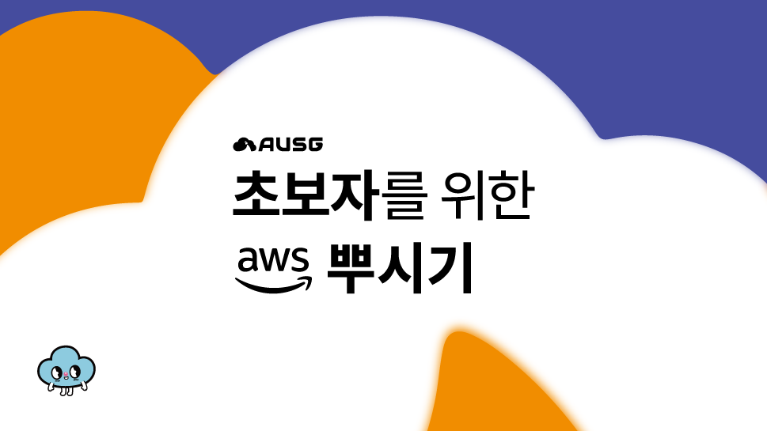

# AWS AppSync로 만드는 서버리스 GraphQL 서비스 (ft. AWS Amplify)

AWS AppSync는 AWS에서 제공하는 관리형 GraphQL 서비스입니다. AppSync를 사용하면 Database API를 편리하게 제작하여 사용할 수 있습니다. 이번 핸즈온에서는 AppSync를 사용하여 GraphQL API를 만들고, React 어플리케이션에서 데이터베이스에 접근할 수 있도록 연동하는 실습을 진행합니다.

## 세션 관련 정보

- 일시: 2020년 1월 15일 오후 7시 ~ 10시
- [🌆Meetup 페이지](https://www.meetup.com/ko-KR/awskrug/events/bsvnmrybccbtb/)
- [🎢세션 발표 PDF](https://github.com/cadenzah/ausg-2020-handson-appsync/blob/master/handson/session.pdf)

## Index
1. [핸즈온 소개](https://github.com/cadenzah/ausg-2020-handson-appsync/blob/master/handson/01.introduction.md)
2. [환경 설정](https://github.com/cadenzah/ausg-2020-handson-appsync/blob/master/handson/02.settings.md)
3. [React 프로젝트 및 Amplify 설정](https://github.com/cadenzah/ausg-2020-handson-appsync/blob/master/handson/03.react.md)
4. [AWS Amplify 연동](https://github.com/cadenzah/ausg-2020-handson-appsync/blob/master/handson/04.amplify.md)
5. [마무리](https://github.com/cadenzah/ausg-2020-handson-appsync/blob/master/handson/05.conclusion.md)
