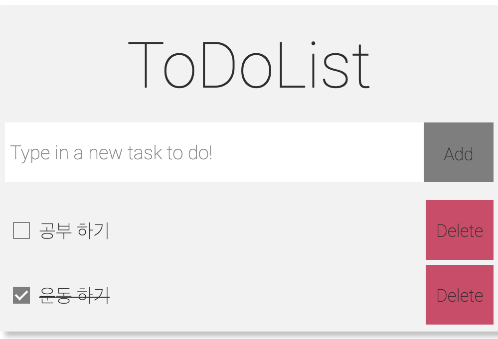
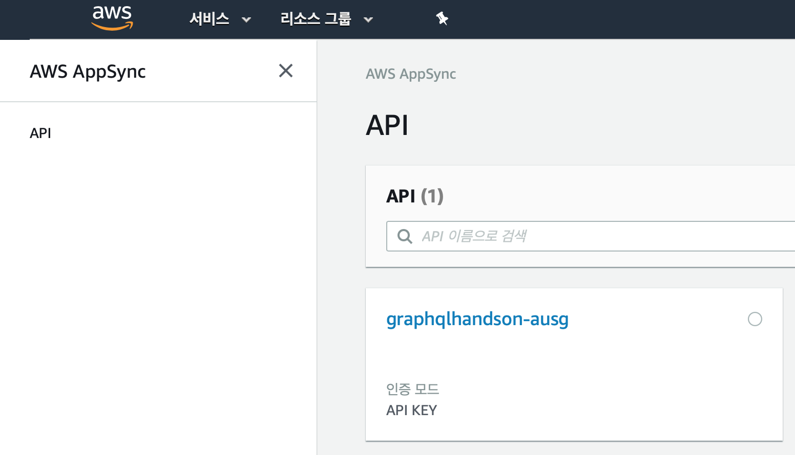

# 3. React 프로젝트 준비 및 Amplify 설정

이번 실습에서 사용할 프론트엔드 어플리케이션을 준비하고, Amplify Framework을 초기화한 뒤 GraphQL API를 생성 및 배포합니다.

## 보일러플레이트 코드 설정

1. 이번 실습에서 사용할 TodoList 프로젝트 코드를 클론합니다.
```bash
$ git clone https://github.com/cadenzah/ausg-2020-handson-appsync.git
```

2. 저장소 디렉토리로 들어간 뒤, NPM 의존 모듈을 설치해줍니다.
```bash
$ cd ausg-2020-handson-appsync
$ npm install
```

> 이 단계에서 NPM 의존 모듈을 설치하고 나면, **이후 실습을 진행하는 동안 Node 버전을 변경하지 말아주세요.** 일부 모듈들이 Node 버전에 맞추어 설치되므로 Node 버전을 변경하면 정상적으로 프로젝트가 실행되지 않습니다.

3. 프로젝트가 정상적으로 작동하는지 확인합니다.
```bash
$ npm run dev
```



위와 같은 웹 페이지를 확인할 수 있으면 프로젝트가 정상적으로 설치된 것입니다.

## Amplify Framework 연동
현재 TodoList 프로젝트는 외부 데이터베이스를 사용하지 않아서 페이지를 새로고치면 모든 할일 목록들이 초기 설정대로 초기화됩니다. 이제 이 프로젝트에 API를 연결하여 데이터가 지속적으로 유지되도록 해주겠습니다.

### 1. `amplify-cli` 설치
Amplify Framework를 사용하려면 `amplify-cli`를 설치해야 합니다. 이 모듈을 사용하면 Frontend 프로젝트에 Amplify Framework를 쉽고 편리하게 적용하고 설정해줄 수 있습니다. 아래의 명령어를 실행하여 해당 모듈을 설치합니다.

```bash
$ npm install -g @aws-amplify/cli
```

`amplify-cli`를 설치하였으면, 터미널에서 아래의 명령어를 수행하여 정상적으로 설치되었는지 확인합니다.

```bash
# 아래 버전은 예시입니다
$ amplify --version
Scanning for plugins...
Plugin scan successful
4.12.0
```

> `@aws-amplify/cli`는 버전에 따라 쉘 명령어의 문구와 작동 방식에 차이가 있습니다. 이미 기존에 `@aws-amplify/cli`를 설치하여 사용하고 계시다면, 실습 진행에 혼동을 방지하기 위하여 4.12.0 버전 사용을 권장합니다.

### 2. Amplify Project 초기화
이제 TodoList 프로젝트에서 Amplify Framework를 사용하기 위한 초기 설정을 시작하겠습니다. 아래의 명령어를 차례대로 실행합니다.

> `amplify-cli` 명령어는 Amplify Framework를 적용할 프로젝트 디렉토리(`ausg-2020-handson-appsync/`) 내에서 실행해주셔야 정상적으로 실행됩니다. `amplify init` 실행시 표시되는 `Note: It is recommended to run this command from the root of your app directory` 문구는 주의 차원에서 항상 표시되는 문구이니 걱정하지 말고 그대로 진행하시면 됩니다.

```bash
# 대괄호 안의 값을 따라서 적어주시면 됩니다
$ amplify init
Scanning for plugins...
Plugin scan successful
Note: It is recommended to run this command from the root of your app directory
? Enter a name for the project [graphql-handson]
? Enter a name for the environment [ausg]
? Choose your default editor: [Visual Studio Code]
? Choose the type of app that you\'re building [javascript]
Please tell us about your project
? What javascript framework are you using [react]
? Source Directory Path:  [src]
? Distribution Directory Path: [build]
? Build Command:  [npm run-script build]
? Start Command: [npm run-script start]
Using default provider  [awscloudformation]

For more information on AWS Profiles, see:
https://docs.aws.amazon.com/cli/latest/userguide/cli-multiple-profiles.html

? Do you want to use an AWS profile? [Yes]
? Please choose the profile you want to use [default]
```

이제, 앞서 입력한 설정들에 따라 저장소가 Amplify Framework에 따른 웹 프로젝트로서 구성됩니다. 설정 초기화가 끝나고 나면, 프로젝트에 다음과 같은 파일들이 추가됩니다.

- `amplify/`: 앞으로 Amplify Framework를 통하여 AWS 상에 자원을 추가하면, 관련된 설정 파일들이 저장되는 디렉토리입니다.
- `src/aws-exports.js`: Amplify가 AWS 상에 추가한 자원을 프로젝트 코드 내에서 사용할 때 사용할 API 액세스 키 등의 Credential 값들이 저장된 파일입니다. 이 파일에 기록된 값들을 사용하여 AWS 자원을 사용할 자격을 얻으므로, **이 파일은 외부로 유출시키거나, GitHub 등 공개된 저장소에 업로드하면 안 됩니다.**
- `.gitignore`: Amplify Framework가 생성한 파일들 가운데 `git`이 추적하면 안 되는 파일들을 자동으로 추가합니다. 이미 기존에 작성된 내용 아래에 추가됩니다.

## GraphQL API 추가
이번 실습의 핵심인, GraphQL API 서비스를 Amplify를 통하여 생성하고 배포해보도록 하겠습니다. 아래의 명령어를 차례대로 실행합니다.

```bash
# 대괄호 안의 값을 따라서 적어주시면 됩니다
$ amplify add api
? Please select from one of the below mentioned services [GraphQL]
? Provide API name: [graphqlhandson]
? Choose an authorization type for the API [API key]
? Enter a description for the API key: [TodoList CRUD API]
? After how many days from now the API key should expire (1-365): [7]
? Do you want to configure advanced settings for the GraphQL API [No, I am done.]
? Do you have an annotated GraphQL schema? [No]
? Do you want a guided schema creation? [Yes]
? What best describes your project: [Single object with fields (e.g., “Todo” with ID, name, description)]
? Do you want to edit the schema now? [Yes]
Please edit the file in your editor: ~/ausg-2020-handson-appsync/amplify/backend/api/ausghandson/schema.graphql
? Press enter to continue
```

이제 GraphQL API가 처리할 데이터의 Schema를 정의해주어야 합니다. 텍스트 에디터가 자동으로 열리면, 에디터에서 열린 `schema.graphql` 파일의 내용을 모두 지우고 다음과 같이 수정합니다.

```graphql
enum Status {
  DONE
  PENDING
}

type Todo @model {
  id: ID!
  desc: String
  status: Status!
  date: String!
}
```

> 만약 에디터가 자동으로 열리지 않으면, `ausg-2020-handson-appsync/amplify/backend/api/ausghandson/schema.graphql`로 경로를 탐색하여 파일을 열고 수정해주세요.

위와 같이 파일을 수정했으면, 저장한 뒤 파일을 닫습니다. 이제 다시 터미널로 돌아가서 Enter 키를 누르고, 작업을 완료합니다.

> `schema.graphql`를 수정하는 작업을 시작하기도 전에 Enter 키를 눌러서 작업이 완료되었더라도 당황하지 마세요. 다음 단계에서 GraphQL API를 Cloud 상에 배포하기 전까지 Schema는 얼마든지 수정할 수 있습니다. `ausg-2020-handson-appsync/amplify/backend/api/ausghandson/schema.graphql` 경로를 탐색하여 파일을 열고 수정해주세요.

### 참고: `@model` 지시자

위의 Schema 코드에서 사용된 `@model` 지시자는 해당 타입을 기반으로 API를 생생할 것임을 Amplify Framework에 알려주는 역할을 담당합니다. Amplify는 `@model` 지시자가 표시된 타입을 기반으로 AWS AppSync 상에 GraphQL API를 생성하는 데에 필요한 여러 가지 기반 작업을 배후에서 자동으로 수행합니다. 아래와 같은 내용이 설정됩니다.

- 데이터를 저장할 Amazon DynamoDB를 구성하고, AWS AppSync에서 연동하도록 설정
- GraphQL Resolver 생성
- Query와 Mutation에 사용될 `input` 타입 생성

이렇게 생성된 설정 파일을 기반으로 다음 단계에서 AWS AppSync 서비스가 구성되고 배포됩니다.

> Amplify Framework와 GraphQL Schema를 사용하여 API를 생성하는 과정에 대하여 자세히 알고 싶다면, [GraphQL Transform 문서](https://aws-amplify.github.io/docs/cli-toolchain/graphql#graphql-transform)를 참조하시기 바랍니다.

## GraphQL API 배포
앞으로 사용할 GraphQL API에 대한 설정을 마쳤습니다. 하지만, 아직 API 서버는 AWS Cloud 상에 배포된 것이 아닙니다. 방금 설정한 GraphQL API를 실제 Cloud 상에 배포하겠습니다. 아래의 명령어를 차례대로 실행합니다.

```bash
# 대괄호 안의 값을 따라서 적어주시면 됩니다
$ amplify push

Current Environment: ausg

| Category | Resource name | Operation | Provider plugin   |
| -------- | ------------- | --------- | ----------------- |
| Api      | ausghandson   | Create    | awscloudformation |
? Are you sure you want to continue? [Yes]

GraphQL schema compiled successfully.
Edit your schema at ~/ausg-2020-handson-appsync/amplify/backend/api/ausghandson/schema.graphql or place .graphql files in a directory at ~/ausg-2020-handson-appsync/amplify/backend/api/ausghandson/schema
? Do you want to generate code for your newly created GraphQL API [No]

✔ All resources are updated in the cloud

GraphQL endpoint: https://<해시값>.appsync-api.ap-northeast-2.amazonaws.com/graphql
GraphQL API KEY: <api-key>
```

Amplify Framework를 통하여 정의한 AWS 자원들이 AWS Cloud 상에 배포되는 데에 약간의 시간이 소요됩니다. 콘솔 상에서 **"✔ All resources are updated in the cloud"** 메시지를 확인하셨다면, GraphQL API가 AWS AppSync 서비스 상에 성공적으로 배포된 것입니다.

메시지 다음 줄에서 확인할 수 있듯 `/graphql` 엔드포인트가 노출된 GraphQL API 서비스가 배포되었고, 이 API를 사용하기 위하여 필요한 API Key가 발급되었습니다. 해당 API에 접근하려면 이 Key가 반드시 필요합니다.

> 유효 기간이 만료된 API Key를 사용하여 AWS AppSync의 API 서비스에 접근할 경우 오류가 발생합니다. 더 긴 유효 기간이 필요하다면 최대 365일까지 연장할 수 있습니다. 또는 다른 인증 방법을 사용할 수도 있습니다. AWS AppSync의 인증에 대한 자세한 사항은 [AWS AppSync: 보안](https://docs.aws.amazon.com/ko_kr/appsync/latest/devguide/security.html) 문서를 참고하시기 바랍니다.

---

여기까지 제대로 진행되었으면, AWS Cloud 상에 AWS AppSync 서비스를 통하여 GraphQL API가 생성되었습니다. 



> AWS AppSync 서비스가 배포되면, 이와 관련된 설정 파일이 AWS S3 상에 자동으로 생성되어 저장됩니다.

하지만 아직 TodoList 프로젝트에서는 GraphQL API를 사용하고 있지 않은 상태입니다. 이제 앞서 배포한 API를 TodoList 어플리케이션에서 사용할 수 있도록 연동하겠습니다.

← [이전 장으로 (2/5)](https://github.com/cadenzah/ausg-2020-handson-appsync/blob/master/handson/02.settings.md) | [다음 장으로 (4/5)](https://github.com/cadenzah/ausg-2020-handson-appsync/blob/master/handson/04.amplify.md) →
