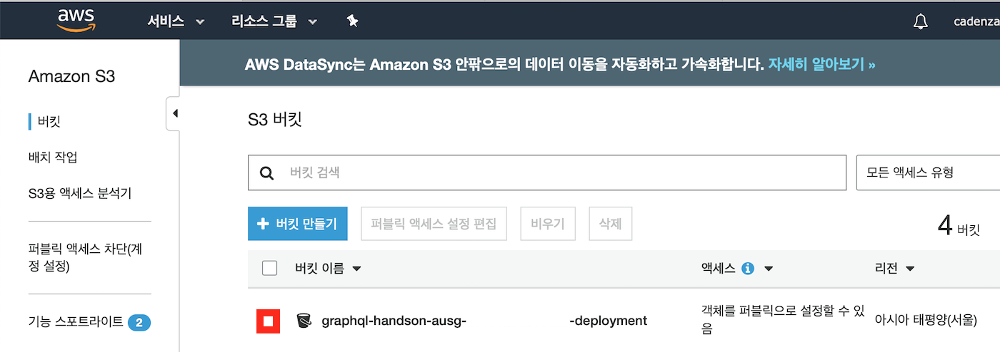
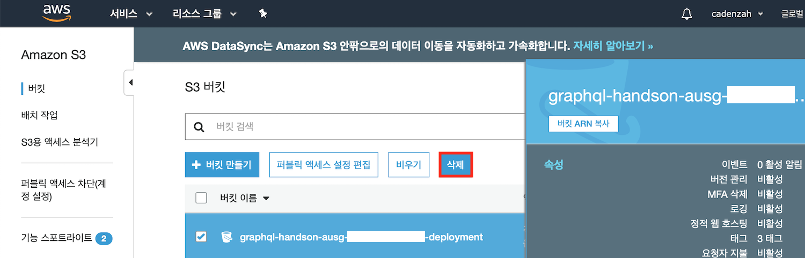
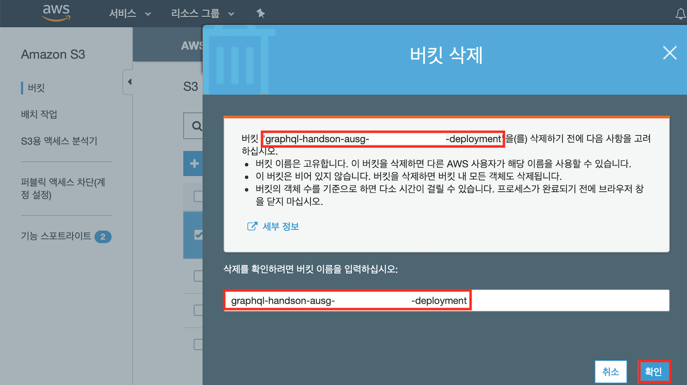
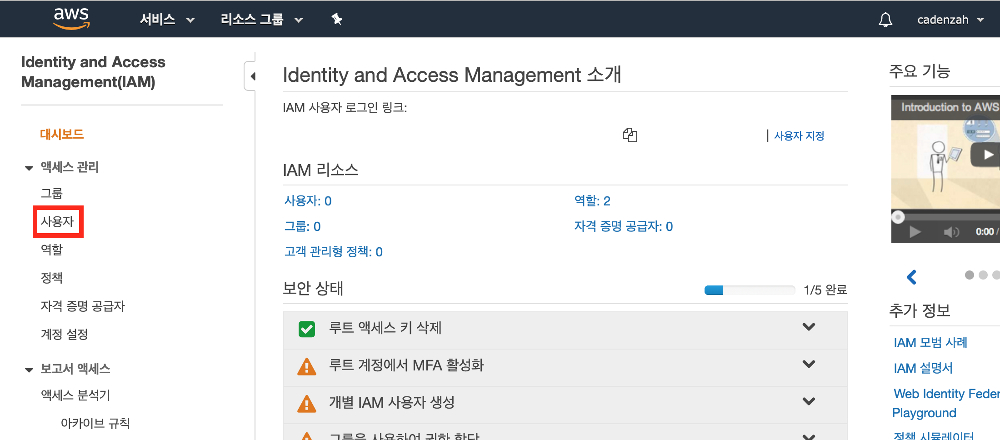
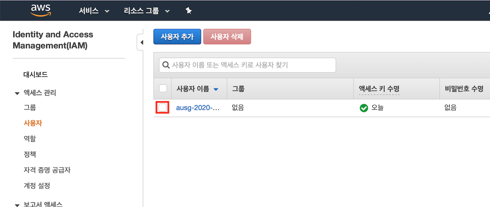
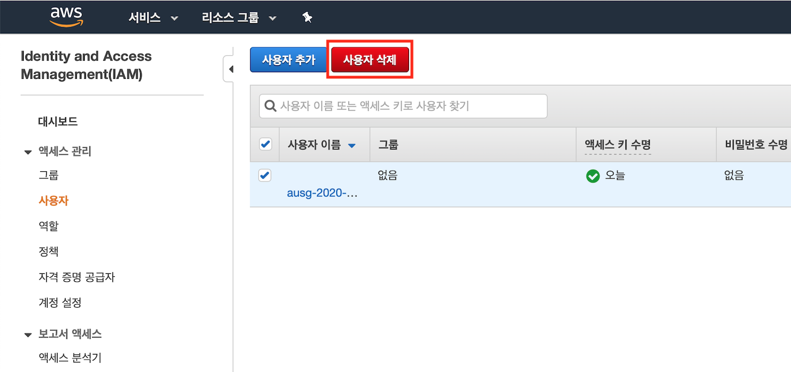
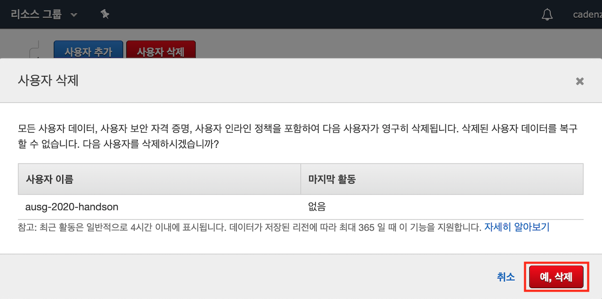

# 5. 마무리
여기까지 오셨다면 모든 실습을 성공적으로 마무리한 것입니다. 수고하셨습니다! 이제, 실습을 수행하기 위하여 생성한 AWS 자원들, 모든 권한을 가지는 루트 권한 IAM 자격을 제거하겠습니다.

## 실습에서 사용된 AWS 자원 제거하기

### Amplify Framework를 통한 자원 제거
앞서 Amplify Framework를 사용하여 AWS 서비스 자원을 생성하였던 것과 마찬가지로, 생성된 자원들을 제거할 수도 있습니다. 아래의 명령어를 실행합니다.

```bash
# 대괄호 안의 값을 따라서 적어주시면 됩니다
$ amplify delete
? Are you sure you want to continue?(This would delete all the environments of the project from the cloud and wipe out all the local amplify resource files) [Yes]
⠋ Deleting resources from the cloud. This may take a few minutes...
```

조금만 기다리면, Amplify를 통하여 배포된 AWS 자원들이 성공적으로 제거된 것을 AWS Console 상에서 확인할 수 있습니다.

### AWS S3에서 AWS AppSync 설정 파일 제거하기

직전 단계에서 AWS 자원들을 제거하였지만, AWS AppSync 서비스에 필요한 설정 파일들이 자동으로 제거되지 않는 경우가 있습니다. 이 경우, 해당 파일을 저장하고 있는 S3 버킷을 직접 제거하여야 합니다.

1. [AWS Management Console](https://console.aws.amazon.com)에 접속합니다.

2. 상단 바에서 [서비스]를 누르면 나타나는 메뉴의 검색 창에 `S3`을 입력하고, 추천에 나타나는 [S3: 클라우드의 확장 가능한 스토리지]를 선택합니다.

3. 아래의 버킷 목록에서 이번 실습에서 사용한 S3 버킷을 확인하고, 체크박스를 선택합니다.

    

4. 체크박스를 선택하면 해당 버킷에 대한 정보를 나타내는 모달이 나타나고, 버킷 목록 상단에 버튼들이 활성화됩니다. [삭제] 버튼을 클릭합니다.

    

5. [버킷 삭제] 모달 내에서 안내에 따라 버킷을 삭제합니다.

    

## IAM 사용자 제거하기

앞서 안내한 것처럼, 이번 실습에서 사용한 IAM 자격 증명은 AWS 계정의 모든 자원에 접근할 수 있으므로 실제 프로덕션 환경에서는 사용하면 안 됩니다. 해당 IAM 자격 증명을 제거하겠습니다.

1. [AWS Management Console](https://console.aws.amazon.com)에 접속합니다.

2. 상단 바에서 [서비스]를 누르면 나타나는 메뉴의 검색 창에 `IAM`을 입력하고, 추천에 나타나는 [IAM: AWS 리소스에 대한 액세스 관리]를 선택합니다.

3. 왼쪽 대시보드에서 [사용자] 메뉴를 선택합니다.

    

4. IAM 사용자 목록에서 이번 실습에서 사용한 IAM 사용자를 확인하고, 체크박스를 선택합니다.

    

5. IAM 사용자를 선택하면 IAM 사용자 목록 상단의 버튼이 활성화됩니다. [사용자 삭제] 버튼을 클릭합니다.

    

6. [사용자 삭제] 모달 내에서 안내에 따라 IAM 사용자를 삭제합니다.

    

## 더 알아보기

이번 실습에서는 AWS AppSync를 사용하여 GraphQL API를 생성하고 배포해봤습니다. 이 외에도 Amplify Framework를 사용하면 다양한 AWS 서비스들을 사용하여 나의 서비스에 기능을 추가할 수 있습니다.

`amplify help` 명령어는 `amplify-cli`에 대한 도움말 문서를 표시해주는 명령어입니다. 이 명령을 실행하면 제일 먼저, Amplify Framework를 사용하여 추가할 수 있는 기능들의 목록이 표시됩니다.

```bash
$ amplify help
Scanning for plugins...
Plugin scan successful
| Category      |
| ------------- |
| analytics     |
| api           |
| auth          |
| function      |
| hosting       |
| interactions  |
| notifications |
| predictions   |
| storage       |
| xr            |

... # 이후 amplify-cli 명령어에 대한 설명이 표시됩니다
```

각각의 기능들을 간단하게 소개해보면 다음과 같습니다.

- `analytics`: Amazon Pinpoint, Amazon Kinesis를 사용한 어플리케이션의 통계 데이터 수집
- `api`: AWS AppSync, AWS API Gateway를 사용한 REST API 또는 GraphQL API
- `auth`: AWS Cognito, OAuth 등을 사용한 사용자 인증
- `function`: AWS Lambda를 사용한 백엔드 함수
- `hosting`: AWS S3를 사용한 정적 페이지 호스팅
- `interactions`: Amazon Lex를 사용한 AI 기반의 챗봇
- `notifications`: Amazon Pinpoint를 사용한 푸시 기능(React Native 전용)
- `predictions`: Amazon이 제공하는 다양한 AI 및 ML 서비스를 활용한 강화 학습 기능
- `storage`: Amazon S3를 사용한 데이터 저장
- `xr`: Amazon Sumerian를 사용한 AR/VR 기능

구체적인 활용 방법은 [Amplify Framework Document](https://aws-amplify.github.io/docs/js/start?platform=purejs)와 [AWS Amplify CLI 저장소의 카테고리 별 문서(English)](https://github.com/aws-amplify/amplify-cli#category-specific-commands)를 참조하시기 바랍니다.

## 참고 자료
- [AWS-CLI](https://docs.aws.amazon.com/ko_kr/cli/latest/userguide/cli-chap-welcome.html)
- [IAM이란?](https://docs.aws.amazon.com/ko_kr/IAM/latest/UserGuide/introduction.html)
- [AWS Amplify: Getting Started](https://aws-amplify.github.io/docs/js/start)
- [AppSync 소개](https://aws.amazon.com/ko/appsync/)
- [Resolver VTL Guide](https://docs.aws.amazon.com/ko_kr/appsync/latest/devguide/resolver-mapping-template-reference.html)
- [AppSync 입문 가이드](https://dev.classmethod.jp/cloud/aws/aws-appsync-re-introduction-2019-korean-ver/)
- [VTL 소개](https://dev.classmethod.jp/cloud/appsync-resolver-vtl-tutorial-ko/)
- [AWS 발표](https://www.slideshare.net/awskorea/aws-app-sync-piljoong-kim)
- [App Sync, 모바일 개발을 위한 GraphQL as a Service – 원지혁 | 대학생 모임 : AWS Community Day](https://www.youtube.com/watch?v=chUsMVg04nU)
- [Amplify-Photo Gallery 예제](https://awskrug.github.io/amplify-photo-gallery-workshop/40_graphql/20_trying_out_queries.html)
- [GraphQL Tutorial - How to Manage Image & File Uploads & Downloads with AWS AppSync & AWS Amplify](https://dev.to/dabit3/graphql-tutorial-how-to-manage-image-file-uploads-downloads-with-aws-appsync-aws-amplify-hga)
- [Mac에서 Node.js 설치하기](http://junsikshim.github.io/2016/01/29/Mac에서-Node.js-설치하기.html)
- [NVM으로 노드 버전 관리하기](http://jeonghwan-kim.github.io/2016/08/10/nvm.html)

## 문의 및 질문
Issue로 남겨주시면 최대한 답변드리도록 하겠습니다 😃

← [이전 장으로 (4/5)](https://github.com/cadenzah/ausg-2020-handson-appsync/blob/master/handson/04.amplify.md) | [처음으로](https://github.com/cadenzah/ausg-2020-handson-appsync/blob/master/handson/01.introduction.md)
